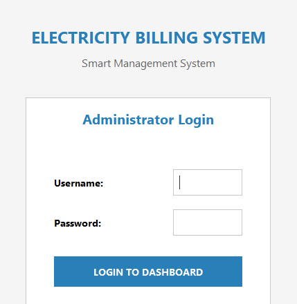
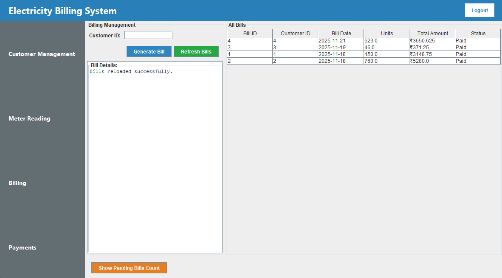
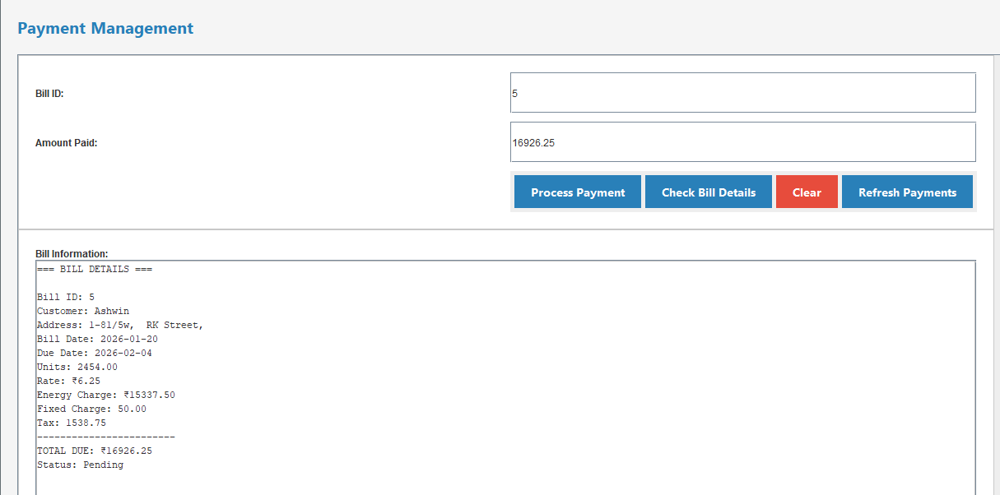
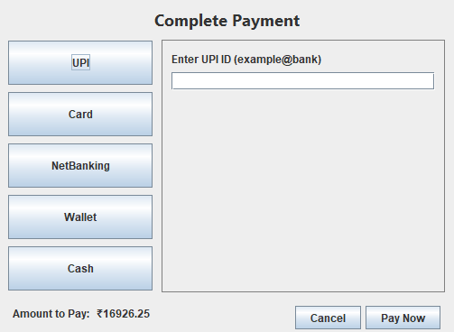

# Electricity Billing System (Java + JDBC)

## Overview
A desktop-based Electricity Billing System developed using Java Swing and JDBC.
The application manages customer details, meter readings, bill generation, and payment records.
This project was built to practice Object-Oriented Programming concepts, GUI development, and database connectivity using JDBC.

## Features
- User authentication (login screen)
- Customer management (add, update, view)
- Meter reading entry
- Electricity bill calculation
- Payment record handling
- CRUD operations using JDBC

## Tech Stack
- Java
- Java Swing (GUI)
- JDBC
- MySQL (local database)
- Eclipse IDE

## Project Structure
```text
src/
 └── electricity/billing/system/
     ├── LoginFrame.java
     ├── MainFrame.java
     ├── BillingForm.java
     ├── PaymentForm.java
     ├── MeterReadingForm.java
     ├── CustomerForm.java
     ├── DBConnection.java
     └── StyleConstants.java
```
## Screenshots

### Login Screen


### Billing Screen


### Payment Screen
 

## Database Details
- Uses a local MySQL database
- Database schema and credentials are not included for security reasons
- JDBC connection is handled inside DBConnection.java

## Tables
- customers
- meter_readings
- bills
- payments

## Limitations
- Database is local and not hosted
- UI and business logic are tightly coupled
- No DAO or service layer abstraction

## Future Improvements
- Introduce DAO and service layers
- Improve exception handling
- Add role-based access control
- Export bills as PDF
